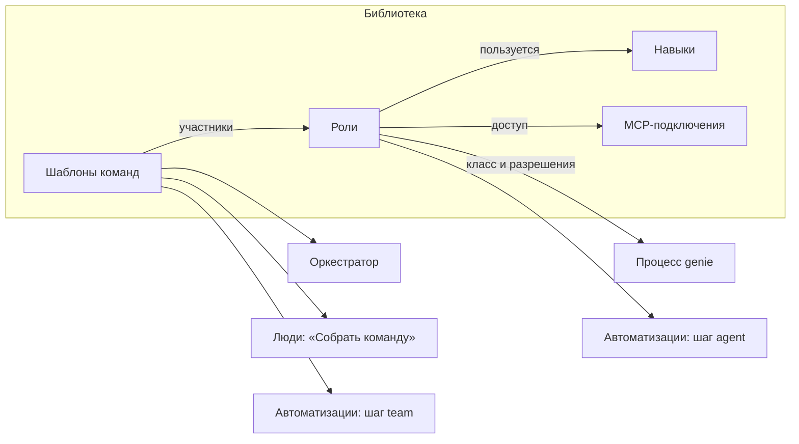
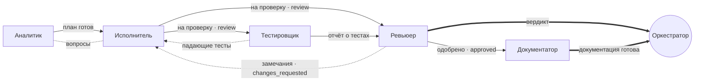

# Роли агентов и шаблоны команд

Контекст — [[platform/vision]], рантайм агентов — [[platform/backend]] и [[platform/agent-bus]] (живые сессии и почта), автоматизации — [[platform/automations]], знания — [[platform/knowledge-vault]].

## Что нужно

Запрос владельца (2026-09-28):

1. Заводить роли под проект.
2. Заводить шаблоны команд.
3. Указывать ролям навыки (skills), которыми они пользуются.
4. Выдавать ролям разные разрешения.
5. Выдавать ролям доступ к разным MCP-серверам.
6. Задавать в шаблоне команды связи между ролями.
7. Настраивать всё это файлами или визуально в вебе, одно и то же двумя способами.
8. Делать настройки общими: созданный шаблон видят все и могут использовать в своих задачах и автоматизациях.

## Как сейчас и что мешает

| Что | Как устроено | Чем мешает |
|---|---|---|
| Роли | Enum из пяти ролей команды в коде (`Role` в `genie-core/src/model.rs`), промпты `agents/*.md` вшиты в бинарь; переопределение — только целым файлом `<data>/agents/<роль>.md` | Новую роль не завести; роль «под проект» — тем более |
| Модели | `roleModels` в конфиге сервера | Одна настройка на всю инсталляцию |
| Шаблоны | `teams` в `config/default.json` и `<data>/config.json` | Правятся только файлом на машине сервера, в вебе не видны; оркестратору список зашит в промпт (`--template standard\|pair\|…`) |
| Связи | Зашиты в код kickoff по названиям ролей (`runtime.rs`, `kickoff`) и в тексты промптов («передай исполнителю») | Шаблон, не похожий на встроенные, получает неверные инструкции. Пример — `spike` (аналитик + ревьюер на готовой задаче): аналитику велено «передать исполнителю», ревьюеру — «ждать исполнителя», которого нет; до `approved` задачу никто довести не может, оркестратор закрывает её через `force` |
| Права | Переходы статусов и правка полей задачи — по ролям в коде (`model.rs`, `tracker.rs`); агент меняет только свою задачу; `excludeTools` из frontmatter → `--exclude-tools` у участников команд | Права нельзя настроить. У разовых заданий инструменты не ограничиваются вовсе, а `workspace: read-only` и `worktree` запускают агента в основной рабочей копии репозитория |
| MCP | `mcp:` во frontmatter учитывает только TS-расширение pi (фильтр инструмента `mcp` из pi-mcp-adapter) | Агенты на сервере (живые сессии и ходы) запускаются с `GENIE_ROLE=off`, так что при установленном pi-mcp-adapter любой агент получает все MCP-серверы, настроенные на машине |
| Навыки | Понятия нет | pi подхватывает все установленные навыки для всех ролей |
| Общий доступ | Шаблоны — в конфиге сервера, роли — файлы в каталоге данных | Нет редактирования в вебе, прав на правку, истории изменений, области «только этот проект» |

## Принципы

1. **Роль — граница безопасности и поведения, шаблон — композиция.** Всё, что расширяет возможности агента (разрешения, MCP, навыки, инструменты), живёт только в роли. Шаблон собирает роли в команду и задаёт связи; расширить права участника он не может. Поэтому шаблоны можно доверить всем, а роли — администраторам.
2. **Процесс не настраивается, настраиваются роли.** Статусы, DoR/DoD и шаги, доступные только оркестратору, остаются зашитыми (см. «Что сознательно не делаем» в [[platform/vision]]). Роль выбирает разрешения из фиксированного каталога.
3. **Файл — источник правды, веб — редактор файла.** Всё, что настроено в вебе, лежит файлом; всё, что лежит файлом, видно и правится в вебе. Формат один, сервер проверяет его при сохранении и при загрузке, история — в git.
4. **Общее по умолчанию.** Библиотеку видят все люди инсталляции; область (общая или проектная) ограничивает только то, где элемент можно использовать.
5. **Жёстко там, где можно, и честно там, где нельзя.** Что проверяет сервер (трекер, знания, почта, токены, MCP через шлюз), то жёстко. Что держится только на флагах харнесса (запрет записи файлов при доступном bash), в интерфейсе помечено как «мягкое» до контейнеров (Ф7).
6. **Без регресса.** Встроенные роли и шаблоны после переноса ведут себя как сейчас, кроме исправленных ошибок; старые настройки подхватываются автоматически.

## Понятия

| Понятие | Что это |
|---|---|
| **Роль агента** | Кто агент и что ему можно: промпт, класс, модель, навыки, разрешения, инструменты, MCP. Не путать с **ролью человека в проекте** (viewer, member, admin, owner) — это права людей, они не меняются |
| **Класс роли** | Одна из встроенных ролей процесса: `analyst`, `executor`, `reviewer`, `tester`, `documenter`. Задаёт набор разрешений по умолчанию, пул имён и то, как роль выглядит в истории задачи. Оркестратор — отдельный класс, одна роль на проект |
| **Шаблон команды** | Состав команды (участники — роли), связи между участниками, общие правила команды, стадия задачи и рабочее место |
| **Связь** | Кто кому передаёт работу, кто кому возвращает на доработку, кто докладывает оркестратору, кого можно спрашивать |
| **Навык** | Каталог по стандарту Agent Skills: `SKILL.md` с инструкциями, при необходимости скрипты и справочные файлы |
| **MCP-подключение** | Описание MCP-сервера в реестре genie: команда или URL, ссылки на секреты, проекты, где его можно использовать |
| **Разрешение** | Право из фиксированного каталога genie (например, `status.approve` — одобрить работу) |
| **Библиотека** | Роли, шаблоны, навыки и MCP-подключения инсталляции |
| **Область** | `общая` — видна и применима во всех проектах; `проект` — применима только в одном проекте (видна его участникам) |



## Библиотека

### Где лежит

Отдельный git-репозиторий в каталоге данных сервера (`<data>/library`, путь меняется ключом `library.path`). Сервер — единственный, кто пишет в него из веба: проверяет права, валидирует, коммитит от имени автора. Файлы можно править и руками на машине сервера — сервер замечает изменения, как в vault. Синхронизация с удалённым репозиторием появится вместе с такой же для vault; право записи в удалённый репозиторий библиотеки равно правам администратора сервера.

```
<data>/library/
  roles/
    reviewer.md               переопределение встроенной роли для всех проектов
    security-reviewer.md      новая общая роль
  teams/
    security-review.md        новый общий шаблон
  skills/
    owasp-review/SKILL.md
    clean-abap/SKILL.md, references/…
  mcp.json                    MCP-подключения (только администраторы сервера)
  projects/
    erp/
      roles/sap-analyst.md    роль только проекта erp
      roles/executor.md       переопределение executor только в erp
      teams/abap.md
      skills/erp-glossary/SKILL.md
```

Почему не в vault и не в БД:

- **vault** даёт Obsidian и ревью через предложения, но правки из Obsidian приходят через git в обход политик разделов. Для страниц знаний это приемлемо, а для разрешений и MCP-доступа означало бы, что любой с доступом к git-репозиторию знаний выдаёт агентам права. Кроме того, знания и конфигурация живут в разном ритме.
- **БД** (как автоматизации сейчас) проще в CRUD, но тогда «настройка файлами» сводится к импорту и экспорту, а историю изменений пришлось бы писать отдельно.

Позже в библиотеку могут переехать и автоматизации (`automations/*.md`) — вся настройка команды будет жить как код в одном репозитории.

### Слои и переопределения

Элемент ищется по идентификатору (имя файла, `[a-z][a-z0-9-]*`) сверху вниз:

1. проект — `projects/<slug>/…`;
2. общая библиотека — корень `library/`;
3. встроенное — вшито в бинарь (нынешние `agents/*.md` и шаблоны из `config/default.json`, дополненные связями).

- **Переопределение.** Роль проекта с тем же идентификатором, что у общей, наследует всё, чего не указала сама. Поэтому переопределение может быть коротким — «в проекте erp исполнитель работает на другой модели и знает Clean ABAP»:

  ```markdown
  ---
  model: openai-codex/gpt-6-luna
  skills: [clean-abap]
  ---
  ```

  Пустое тело — промпт наследуется; непустое дописывается к промпту родителя разделом «Project specifics».
- **Наследование.** Новая роль может взять за основу другую: `extends: reviewer`. Правила те же: скалярные поля заменяются, списки заменяются целиком (предсказуемо; веб показывает итог с пометками «унаследовано»), тело дописывается. `permissions.allow` и `deny` наследника применяются к итоговому набору родителя.
- Шаблоны не наследуются и не сливаются: шаблон проекта с тем же идентификатором заменяет общий целиком. «Настроить для проекта» в вебе копирует общий шаблон в проект.
- Роли в шаблоне разрешаются **в контексте проекта**. Общий шаблон `standard` в проекте erp получает исполнителя с переопределением erp — один шаблон на всех, тонкая настройка ролей по проектам.

### Общий доступ и права на правку

Всё в библиотеке видно всем, у кого есть доступ к проекту (общее — всем пользователям сервера). Правка:

| Что | Создаёт и правит | Почему |
|---|---|---|
| Шаблоны | Любой участник проекта с правом записи — в своём проекте и в общей библиотеке; правят автор и администраторы (проекта или сервера — по области) | Шаблон не расширяет права (принцип 1), поэтому общие шаблоны может заводить каждый |
| Роли проекта | Администраторы проекта | Роль — граница безопасности |
| Общие роли | Администраторы сервера | Меняют поведение агентов во всех проектах |
| Навыки | Добавляет любой участник. Пока навык не подключён ни к одной роли, его правит автор; подключённый — те, кто правит роли, где он используется | Неподключённый навык ни на что не влияет, а подключённый — часть инструкций агента |
| MCP-подключения и секреты | Администраторы сервера | Подключение — это команда, запускаемая на машине сервера, и доступ к внешней системе |

У элемента есть владелец (`owner`, сервер ставит его при создании). В вебе рядом с каждым элементом видно: область, источник (встроенное, библиотека, файл изменён вручную), автор, где используется.

### Проверка и история

- Сервер проверяет файл при сохранении из веба (невалидное не сохраняется) и при загрузке с диска. Если файл сломали руками, продолжает работать последняя валидная версия, а в вебе висит ошибка с указанием строки.
- Сохранение из веба сверяется с хэшем версии, открытой в редакторе (как в vault): чужая правка не перетирается, пользователь видит конфликт.
- Каждое изменение — коммит от имени автора. В вебе есть история файла с diff и «вернуть эту версию».
- Изменения библиотеки приходят в веб живым потоком: открытые экраны обновляются сами.

## Роль

### Файл роли

Markdown с YAML-frontmatter, как `agents/*.md` сейчас и как субагенты Claude Code: frontmatter — настройки, тело — промпт.

```markdown
---
title: Ревьюер безопасности
description: Независимо проверяет изменение на уязвимости (OWASP Top 10, секреты, права доступа) и выносит вердикт. Звать для изменений в авторизации, платежах и работе с персональными данными.
base: reviewer
model: litellm/claude-opus-5-5
thinking: high
names: [argus, heimdall, cerberus]
permissions:
  deny: [task.check]
tools:
  files: read
  shell: true
  denyCommands: ["git push*", "git reset --hard*"]
skills:
  - owasp-review
  - name: secrets-scan
    when: перед вердиктом по любому изменению конфигов, CI или .env
mcp:
  semgrep: all
  github: [get_pull_request, list_commits, get_file_contents]
owner: anna
---

You are the **security reviewer** of a focus team. You verify, you do not implement.
…
```

| Поле | Значение |
|---|---|
| `title` | Название для людей (в вебе, в уведомлениях) |
| `description` | Когда звать эту роль. Оркестратор выбирает роли и шаблоны по описаниям, поэтому описание — это инструкция для него |
| `base` | Класс роли. Обязателен для новой роли, если нет `extends` |
| `extends` | Роль-основа, от которой наследуются незаданные поля |
| `model`, `thinking` | Модель и уровень рассуждений по умолчанию |
| `names` | Пул шуточных имён; по умолчанию — пул класса |
| `permissions` | `allow` и `deny` относительно набора класса (см. «Разрешения»); итоговый набор веб показывает целиком |
| `tools` | Рабочее место: `files` (`none`, `read`, `write`), `shell`, `denyCommands` |
| `skills` | Навыки: идентификатор, либо объект с `when` (когда пользоваться) и `preload` (текст навыка сразу в промпте) |
| `mcp` | Доступ к MCP-подключениям: `all` или список инструментов (допускаются шаблоны `read_*`) |
| `stages` | На каких стадиях задачи роль может работать: `refinement` (до `ready`), `delivery`; по умолчанию — как у класса |
| `owner` | Владелец элемента |

### Классы и то, что они задают

| Класс | Разрешения по умолчанию (сверх общих) | Файлы | Стадии | Пул имён |
|---|---|---|---|---|
| analyst | `status.refine`, `status.start`, `task.scope`, `task.plan`, `task.create` | read | refinement, delivery | детективы |
| executor | `status.start`, `status.rework`, `status.submit`, `task.plan` | write | delivery | роботы |
| reviewer | `status.approve`, `status.return`, `task.check` | read | refinement, delivery | мудрецы |
| tester | `status.return` | write | delivery | хаос |
| documenter | — | write | refinement, delivery | писатели |
| orchestrator | разбор, готовность, решения владельца, приёмка, нарезка, сбор команд и заданий — другим ролям не выдаются | write | — | — |

Общие разрешения всех классов: `task.block`, `docs.read`, `docs.write`, `mail.team`, `mail.orchestrator`, `team.peek`. Вместе с таблицей это ровно нынешнее поведение: переходы из `model.rs`, проверки полей задачи в `tracker.rs`, `excludeTools` из `agents/*.md`.

### Как собирается промпт агента

1. Тело роли (с учётом переопределений и `extends`).
2. Раздел «Как ты действуешь в genie» — таблица команд `genie agent …`, **только разрешённых роли**.
3. Проект и языковая политика.
4. «Твоя команда» — из связей шаблона (см. ниже) и общих правил команды из тела шаблона.
5. «Твои навыки» — имя, описание, когда пользоваться; для `preload: true` — полный текст навыка.
6. «MCP» — доступные подключения и их назначение.
7. Инструкции участнику из шаблона или от того, кто его добавил.

Промпт и флаги харнесса (модель, инструменты, навыки, MCP) агент получает при старте: участник команды и оркестратор — при запуске живой сессии ([[platform/agent-bus]]), разовое задание — на каждый ход.

## Разрешения

### Каталог

| Группа | Разрешение | Что даёт |
|---|---|---|
| Статусы | `status.refine` | draft → refining |
| | `status.start` | ready → in_progress |
| | `status.rework` | changes_requested → in_progress |
| | `status.submit` | in_progress → review |
| | `status.approve` | review → approved |
| | `status.return` | review → changes_requested |
| Задача | `task.scope` | Название, тип, описание, критерии приёмки, зависимости, эпик |
| | `task.plan` | План реализации |
| | `task.check` | Отмечать критерии приёмки |
| | `task.create` | Создавать подзадачи своей задачи |
| | `task.block` | `block` и `unblock` |
| Знания | `docs.read` | Поиск и чтение vault |
| | `docs.write` | Запись страниц; политика раздела по-прежнему решает, прямая это правка или предложение |
| Общение | `mail.team` | Письма и вопросы с ожиданием ответа участникам команды (`send`, `ask`); в режиме `flow` — только по связям шаблона |
| | `team.peek` | Смотреть, чем занят сосед по команде (`peek`) |
| | `mail.orchestrator` | Письма оркестратору в обход «голоса команды» — вопросы и блокеры |
| Люди (позже) | `people.ask` | Задать вопрос человеку опросником — как шаг `ask` автоматизаций |

Комментарии, артефакты, заметки, метки и строка статуса в карточке команды доступны всем ролям всегда: без них агент не может отчитаться о работе.

Роль берёт набор своего класса и правит его через `allow` и `deny`. Примеры: тестировщик с `task.check` отмечает критерии, которые подтвердил тестами; `researcher` — аналитик с `status.submit`, который сдаёт выводы на ревью; оркестратор без записи файлов — он не реализует задачи сам.

### Что не настраивается

- Переходы в `draft`, `ready`, `needs_owner`, `done`, `cancelled` делает только оркестратор или человек; выдать их роли команды нельзя. Так же только им доступны нарезка задач (`split`), приоритет, стратегия интеграции и исполнители, а ещё прерывание агентов (`interrupt`) и пауза.
- Агент меняет только свою задачу и её подзадачи и оставляет заметки в эпике.
- DoR и DoD проверяются как сейчас.
- **Новое правило — разделение обязанностей:** участник, сдавший работу на ревью, не может сам же её одобрить в этом раунде. Сейчас это гарантируют классы, а с настраиваемыми разрешениями нужен явный запрет.

### Рабочее место и инструменты

| Настройка | Как применяется | Сила |
|---|---|---|
| `tools.files: read` | pi: `--exclude-tools edit,write`; другие харнессы — их аналоги | Мягкая: через bash агент может записать файл |
| `tools.files: none` | Рабочий каталог — пустой каталог агента | Мягкая |
| `tools.denyCommands` | pi: проверка в расширении genie-bus (событие `tool_call` блокирует вызов bash по шаблону); Claude Code — `--disallowedTools` | Мягкая |
| `tools.shell: false` | Возможно только после MCP-эндпоинта genie: сейчас агенты действуют через `genie agent …` в shell | — |
| `workspace` шаблона | Каталог, в котором работает команда (см. «Шаблон команды») | Жёсткая по каталогу, мягкая по записи |

Жёсткая изоляция файлов (read-only монтирование, отдельный пользователь ОС, контейнер на команду) — вместе с контейнерами в Ф7. До тех пор веб помечает «мягкие» ограничения как соблюдаемые харнессом.

То же относится к разовым заданиям автоматизаций: их `workspace` начинает соблюдаться (`read-only` → без записи, `worktree` → свой worktree), а инструменты берутся из роли задания.

### Где проверяется

| Что | Где | Сила |
|---|---|---|
| Разрешения на задачи, знания, почту, сбор команд | Сервер, по токену агента | Жёсткая |
| MCP | Сначала — конфиг для харнесса при старте агента, затем — шлюз genie | Средняя, затем жёсткая |
| Навыки | Флаги харнесса (`--no-skills` + `--skill`) | Мягкая: это инструкции, а не доступ |
| Файлы и команды shell | Флаги и расширение харнесса | Мягкая до Ф7 |

Токен агента (живой сессии или хода задания) получает идентификатор роли, а не только класс. Сервер находит роль в библиотеке при каждом запросе, так что отзыв разрешения действует сразу, даже для уже работающей команды.

## Навыки

- Формат — [Agent Skills](https://agentskills.io/specification): каталог с `SKILL.md` (`name`, `description`) и сопутствующими файлами. Его понимают pi и Claude Code, готовые наборы (например, `anthropics/skills`, `badlogic/pi-skills`) подключаются как есть.
- Источники: `library/skills/` и `library/projects/<slug>/skills/`; создание и правка в вебе (редактор `SKILL.md`, загрузка файлов); импорт из git-репозитория или пакета.
- Навыки репозитория проекта (`.agents/skills`, `.pi/skills`) — часть кода проекта. Роль получает их, если не указано `repoSkills: false`.
- Роль ссылается на навык по имени и может сказать, **когда** им пользоваться:

  ```yaml
  skills:
    - clean-abap                                   # модель подгружает по описанию, когда нужно
    - name: sap-transport
      when: перед сдачей — проверить состав объектов транспорта
    - name: team-conventions
      preload: true                                # текст сразу в промпте
  ```

- Доставка в харнесс: pi — `--no-skills` и `--skill <каталог>` для каждого навыка роли; другие харнессы — через свой адаптер (для Claude Code — каталог навыков агента). Если в роли нет поля `skills`, агент получает все навыки машины, как сейчас; `skills: []` — ни одного.

## MCP-подключения

### Реестр

`library/mcp.json` в том же формате `mcpServers`, что `.mcp.json` у Claude Code и pi-mcp-adapter (существующие настройки можно вставить как есть), плюс поля genie:

```json
{
  "mcpServers": {
    "sap-dev": {
      "description": "SAP DEV через ADT, только чтение",
      "command": "npx",
      "args": ["-y", "@mcp-abap-adt/core"],
      "env": { "SAP_URL": "https://sap-dev.example:44300", "SAP_USER": "${env:SAP_DEV_USER}", "SAP_PASSWORD": "${secret:sap-dev-password}" },
      "projects": ["erp"]
    },
    "github": {
      "type": "http",
      "url": "https://api.githubcopilot.com/mcp/",
      "headers": { "Authorization": "Bearer ${secret:github-token}" },
      "projects": "*"
    }
  }
}
```

- **Секреты** в библиотеку не попадают: `${env:ИМЯ}` берётся из окружения сервера, `${secret:имя}` — из хранилища секретов сервера (администраторы, в БД в зашифрованном виде, ключ — файл в каталоге данных). Первым шагом достаточно `${env:…}`.
- `projects` — где подключение можно выдавать ролям. Администратор проекта не выдаст своим агентам доступ к подключению другого проекта.
- В вебе: «Проверить подключение» (запуск и список инструментов), где используется, какие роли имеют доступ.

### Выдача роли и доставка

Роль перечисляет подключения и, при желании, инструменты (`mcp: { sap-dev: [read_*, search_*] }`).

1. **Конфиг при старте.** Рантайм собирает для сессии или хода MCP-конфиг только из разрешённых подключений и передаёт харнессу: pi-mcp-adapter — `--mcp-config`, Claude Code — `--mcp-config` вместе с `--strict-mcp-config`. В pi расширение genie-bus дополнительно не пропускает вызовы инструмента `mcp` к чужим подключениям — как делало TS-расширение. Ограничения: секреты оказываются в файле, который агент может прочитать; pi-mcp-adapter добавляет к выданному конфигу глобальные файлы пользователя, поэтому на машине сервера MCP-серверы должны регистрироваться только в genie.
2. **Шлюз genie** (целевое устройство). Сервер открывает MCP-эндпоинт (`/mcp`, Streamable HTTP) с токеном агента. Он отдаёт инструменты genie и проксирует только разрешённые подключения и инструменты. Секреты не покидают сервер; каждый вызов попадает в журнал событий (`mcp.called`: кто, какой сервер и инструмент, результат) — это аудит «какой агент что делал во внешней системе». Шлюз заодно закрывает пункт «MCP-эндпоинт для агентов» из [[platform/roadmap]] и позволяет отключить shell у ролей, которым он не нужен.

## Шаблон команды

### Файл шаблона

Markdown с frontmatter: во frontmatter — состав и связи, в теле — общие правила команды, которые получает каждый участник.

```markdown
---
title: Полная команда
description: Крупное изменение кода — аналитик, исполнитель, тестировщик и ревьюер; документатор подключается после одобрения.
stage: delivery
workspace: worktree
mail: open
members:
  - role: analyst
  - role: executor
  - role: tester
  - role: reviewer
  - role: documenter
relations:
  - { from: analyst,    to: executor,           type: handoff, note: план готов }
  - { from: executor,   to: [tester, reviewer], type: handoff, on: review, note: работа сдана на проверку }
  - { from: tester,     to: reviewer,           type: handoff, note: отчёт о тестах }
  - { from: reviewer,   to: executor,           type: returns, on: changes_requested }
  - { from: tester,     to: executor,           type: returns }
  - { from: reviewer,   to: documenter,         type: handoff, on: approved, note: работа одобрена }
  - { from: reviewer,   to: orchestrator,       type: reports, note: вердикт }
  - { from: documenter, to: orchestrator,       type: reports, note: документация готова }
  - { from: executor,   to: analyst,            type: consults }
owner: anna
---

Commit small, verifiable steps. Every submission carries a test report.
```

| Поле | Значение |
|---|---|
| `title`, `description` | Для людей и для оркестратора: когда подходит этот шаблон |
| `stage` | `refinement` — задача до `ready` (исследование, уточнение), `delivery` — готовая задача. Роли участников должны допускать эту стадию; так обобщается нынешнее правило «до `ready` — только analyst, reviewer, documenter» |
| `workspace` | `worktree` — свой git-worktree; `repo` — основная рабочая копия; `scratch` — пустой каталог команды; `none`. В проекте без кода `worktree` и `repo` означают каталог команды, как сейчас |
| `mail` | `open` — участники пишут кому угодно в команде, как сейчас; `flow` — только по связям, а оркестратору — только «голос команды» и вопросы или блокеры |
| `members` | Участники: `role`, при необходимости `key` (если две одинаковые роли, например `executor-api` и `executor-web`), `name`, `model`, `thinking`, `instructions` |
| `relations` | Связи между участниками (`from` и `to` — ключи участников или `orchestrator`) |
| тело | Общие правила команды — попадают в промпт каждого участника |

### Связи

| Тип | Смысл | Что делает genie |
|---|---|---|
| `handoff` — передаёт работу | A закончил свой шаг и передаёт результат B | B после старта ждёт передачи (ставит статус ожидания и не пишет писем); A знает, кому и что передать |
| `returns` — возвращает на доработку | A может вернуть работу B с замечаниями | A знает, кому возвращать; B знает, от кого ждать замечаний |
| `reports` — докладывает | A — «голос команды» перед оркестратором | A отправляет итог (`intent: verdict` или `done`); в режиме `flow` остальные пишут оркестратору только вопросы и блокеры |
| `consults` — можно спрашивать | A задаёт вопросы B напрямую | В промпте A: «вопросы — к B» (`genie agent ask` ждёт ответа); в режиме `flow` разрешает вопросы и письма A → B и ответы |

- **`on: <статус>` — передача по статусу.** Такую связь исполняет сам genie: когда задача входит в статус, адресаты получают системное письмо с заметкой к смене статуса. Исполнителю достаточно перевести задачу в `review` с заметкой — ревьюер и тестировщик узнают об этом, даже если исполнитель забыл им написать. Связи без `on` исполняет агент по инструкции.
- **Старт участника** выводится из связей: без входящей передачи — начинает сразу, со входящей — ждёт её.
- **Проверки шаблона**:
  - ошибка — у участника нет способа начать (цикл ручных передач);
  - ошибка — стадия шаблона не подходит роли;
  - ошибка — связь ссылается на несуществующего участника;
  - предупреждение — никто не докладывает оркестратору;
  - предупреждение — в шаблоне `delivery` нет роли с `status.submit` или `status.approve` (задачу нельзя будет закрыть без `force`);
  - предупреждение — роль с записью файлов работает в `workspace: repo`, то есть в основной рабочей копии.



Сплошная стрелка — передача работы, пунктирная — возврат на доработку, жирная — доклад оркестратору, пунктир без стрелки — можно спрашивать.

### Что получает участник

Kickoff и раздел «Твоя команда» генерируются из связей, а не из названий ролей. Исполнитель в команде выше получит:

```
You are Bender, the executor of team G-7 (template "full").
Team: Sherlock — analyst, Murphy — tester, Gandalf — reviewer, Tolkien — documenter, plus the orchestrator.
How the team works:
- You start after Sherlock hands over (plan ready): set a waiting status and end your turn.
- When the work is ready, move the task to review with a note — genie passes it to Murphy and Gandalf.
- Gandalf and Murphy may return the work with findings: fix them and submit again.
- Ask Sherlock directly about the plan (`genie agent ask sherlock "…"`).
- Gandalf is the team's voice to the orchestrator; message the orchestrator yourself only with a scope question or a blocker.
```

Промпты встроенных ролей теряют упоминания конкретных коллег («передай исполнителю»): в промпте роли остаётся ремесло, в разделе команды — маршрут. Встроенные шаблоны получают связи, повторяющие нынешнее поведение. `spike` исправляется: в нём работает роль `researcher` (класс analyst плюс `status.submit`) со связями researcher → reviewer → оркестратор, и задача доходит до `approved` без `force`.

### Работающие команды

- **Структура фиксируется при запуске.** Команда хранит снимок: шаблон и его версию, участников, связи, общие правила. Правка шаблона не перестраивает идущие команды; на экране команды видно «шаблон изменён после запуска».
- **Разрешения действуют сразу.** Сервер проверяет их по библиотеке на каждом запросе: отозванное разрешение перестаёт работать немедленно, и в уже работающих командах тоже.
- **Промпт, модель, навыки и MCP — со следующего старта сессии.** Живая сессия получает их при запуске. Правка роли доходит до работающих участников, когда их сессия перезапустится: после простоя (`idleStopSecs`) или по кнопке «Перезапустить с новой ролью» на экране команды. Разговор при этом продолжается, меняются только настройки.

## Как этим пользуются

- **Оркестратор** получает в промпте каталог шаблонов и ролей проекта (идентификатор, описание, стадия, рабочее место). Он собирает команду по шаблону (`genie agent spawn G-7 --template security-review`) или из ролей (`--member reviewer --member security-reviewer`), добавляет участника любой ролью (`genie agent add-member G-7 sap-analyst`). Полный список — `genie agent templates` и `genie agent roles`.
- **Люди в задаче.** На карточке задачи есть кнопка «Собрать команду». Диалог показывает шаблоны, подходящие задаче: по стадии, наличию кода в проекте и области. Для выбранного шаблона видны состав и граф связей; перед запуском можно поменять модели, убрать или добавить участника, оставить заметку.
- **Автоматизации.** Шаг `team` принимает любой шаблон библиотеки (`"template": "security-review"`), шаг `agent` — любую роль (`"role": "sap-analyst"`); инструменты задания, навыки и MCP берутся из роли. Сохранение правила проверяет, что шаблон и роль существуют и доступны проекту. У шаблона и роли видно, какие правила их используют, а при удалении — предупреждение.
- **CLI:** `genie library ls|show|validate|history`, `genie library import|export` — роль или шаблон вместе с зависимыми ролями и навыками одним пакетом, без секретов, чтобы переносить между инсталляциями.

## Веб-интерфейс

В разделе «Команда и правила» появляется пункт «Агенты» с вкладками.

**Роли.** Список общих и проектных ролей: класс, модель, число навыков и MCP, пометка «переопределена в проекте». Страница роли:

- «Промпт» — редактор Markdown с предпросмотром; унаследованная часть видна отдельно;
- «Навыки» — выбор из библиотеки, поле «когда пользоваться», переключатель «сразу в промпте»;
- «Разрешения» — флажки по группам каталога; набор класса отмечен, отличия подсвечены, неизменяемые права видны, но выключены;
- «Инструменты и MCP» — файлы, shell, запрещённые команды, подключения и их инструменты; мягкие ограничения помечены;
- «Файл» — сам файл с подсветкой ошибок: правка здесь и в форме — одно и то же;
- «Где используется» и «История».

**Шаблоны команд.** Карточки: название, описание, аватары участников, миниатюра графа, область, автор, число использований. Страница шаблона:

- участники — таблица: роль, ключ, имя, модель, инструкции;
- связи — таблица «кто → кому → тип → по статусу → заметка» и рядом живой граф. Таблица работает с клавиатуры и на телефоне, граф показывает маршрут и ошибки: участник, который не сможет начать, подсвечен. Протянуть связь мышью прямо на графе — следующий шаг;
- общие правила команды (тело файла);
- «Что получит каждый участник» — сгенерированные kickoff и промпт для выбранной задачи. Шаблон проверяется до запуска;
- «Файл», «Где используется», «История».

**Навыки** — список, просмотр и редактор `SKILL.md` с файлами, какие роли пользуются.

**MCP-подключения** (администраторы) — реестр, проверка подключения, доступность по проектам, ссылки на секреты.

Связанные экраны: «Собрать команду» на карточке задачи; экран команды показывает граф шаблона с живым состоянием участников (кто работает, кто ждёт передачи); редактор правил автоматизаций подсказывает шаблоны и роли.

## API и события

| Маршрут | Что делает |
|---|---|
| `GET /api/library` | Итоговый каталог для текущего проекта: роли, шаблоны, навыки, MCP — с областью, источником, ошибками и использованием |
| `GET/PUT/DELETE /api/library/roles/{id}` | Роль (`?scope=global\|project`); `PUT` принимает файл целиком или поля формы и хэш базовой версии |
| `GET/PUT/DELETE /api/library/teams/{id}` | Шаблон |
| `POST /api/library/teams/{id}/preview` | Kickoff и промпты участников для задачи (`{"task": "G-7"}`) |
| `GET/PUT/DELETE /api/library/skills/{id}[/files/{path}]` | Навык и его файлы |
| `GET /api/library/{kind}/{id}/history`, `POST …/revert` | История и откат |
| `GET/PUT /api/mcp`, `POST /api/mcp/{id}/test` | Реестр MCP (администраторы сервера) |
| `POST /api/teams` | Как сейчас, плюс участники из любых ролей библиотеки |

События: `library.changed` (что, область, кто) — в живой поток веба; `mcp.called` — в журнал проекта, когда появится шлюз.

## Совместимость и перенос

- Встроенные роли и шаблоны — нынешние `agents/*.md` и `teams` из `config/default.json` с добавленными классами и связями; поведение то же, кроме исправленного `spike`. Для TS-версии файлы остаются на месте до её удаления.
- `roleModels` из конфига продолжает работать как модель по умолчанию, если роль её не задаёт. Порядок: явное указание при запуске → участник шаблона → роль (проект → общая → встроенная) → `roleModels` → модель харнесса.
- `teams` из `<data>/config.json` и `<data>/agents/*.md` при первом запуске импортируются в библиотеку одним коммитом, с отметкой в журнале сервера.
- Данные: `members.role` хранит идентификатор роли. Трекер по-прежнему пишет в историю, комментарии и артефакты класс роли: TS-инструменты продолжают читать ту же базу. Токен агента получает поле `role_id`.
- Задания автоматизаций принимают любую роль библиотеки вместо пяти фиксированных.

## Этапы

Каждый этап даёт проверяемый результат.

| Этап | Что входит | Готово, когда |
|---|---|---|
| **Р1. Библиотека и связи** | Формат файлов и проверка; загрузка слоёв (встроенное, общее, проект) с переопределениями; роли по идентификатору с классом; шаблоны со связями и передачами по статусу; kickoff из связей; каталог для оркестратора; шаги `team` и `agent` по библиотеке; API чтения; `genie library ls\|validate`; в вебе — просмотр ролей и шаблонов с графом | Роль и шаблон, заведённые файлами, использует оркестратор и автоматизация; встроенные шаблоны дают прежние kickoff, `spike` доходит до `approved` без `force` |
| **Р2. Редактирование и общий доступ** | Редакторы ролей и шаблонов (форма и файл), права на правку, коммиты, конфликты, история и откат; «Собрать команду» в задаче; предпросмотр участника; «где используется»; проверка ссылок в правилах автоматизаций | Участник проекта в вебе создаёт общий шаблон, коллега в другом проекте запускает по нему команду на своей задаче и в своей автоматизации |
| **Р3. Разрешения и навыки** | Каталог разрешений на сервере вместо таблицы по ролям; разделение обязанностей; инструменты роли → флаги харнесса, в том числе для заданий; библиотека навыков и доставка в харнесс; проверки `denyCommands` и MCP в расширении genie-bus | Роль без `status.approve` получает отказ сервера; у read-only роли нет edit и write; агент видит свои навыки и только их |
| **Р4. MCP** | Реестр, ссылки на секреты, конфиг при старте агента; затем шлюз genie с журналом вызовов | Агент роли без доступа к подключению не видит его инструментов; вызовы MCP видны в журнале проекта |
| **Р5. Связи в работе** | Режим почты `flow`; живой граф на экране команды; протягивание связей на графе; экспорт и импорт пакетов | Команда в режиме `flow` общается только по маршруту шаблона; владелец видит на графе, кто кого ждёт |

## Вопросы к владельцу

| № | Вопрос | Варианты | Рекомендация |
|---|---|---|---|
| RQ1 | Где хранить библиотеку | Отдельный git-репозиторий в каталоге данных; внутри vault; в БД сервера | Отдельный git-репозиторий: файлы и история без обхода прав через git знаний |
| RQ2 | Кто создаёт общие шаблоны | Любой участник (правят автор и администраторы); только администраторы | Любой участник: шаблон не расширяет права |
| RQ3 | Модель ролей | Класс процесса плюс настройка разрешений; полностью свободные наборы разрешений без классов | Класс плюс настройка: процесс остаётся зашитым, история задач совместима |
| RQ4 | Когда делать шлюз MCP | Сразу; после конфига при старте | Конфиг при старте в Р4, шлюз — до выхода за пределы локальной машины (Ф7) или раньше, если в MCP-подключениях чувствительные секреты |
| RQ5 | Настройки в репозитории проекта (`.genie/roles`, `.genie/teams` рядом с кодом, ревью через PR) | Нужен живой слой; хватит разового импорта | Разовый импорт сейчас, живой слой — по запросу |
| RQ6 | «Мягкий» запрет записи файлов до контейнеров | Достаточно с пометкой в вебе; нужна изоляция раньше (отдельный пользователь ОС, read-only монтирование) | Достаточно до Ф7 |
| RQ7 | Люди в шаблонах: участник-человек (автор задачи, `@логин`, роль в проекте), связи с ним — через уведомления и опросники | Сейчас; позже | Позже, после Р2: механизм опросников уже есть |
