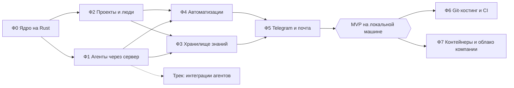

# Дорожная карта genie-платформы

Видение — [[platform/vision]], решения — [[platform/decisions]], бэкенд — [[platform/backend]], знания — [[platform/knowledge-vault]], автоматизации — [[platform/automations]].

Принципы нарезки:

- каждая фаза заканчивается проверяемым результатом;
- до переключения на Rust-сервер (конец Ф1) рабочей остаётся TS-версия; новые возможности пишутся только на Rust;
- всё MVP разворачивается и проверяется на локальной машине.

## Статус MVP (2026-09-28)

MVP реализован на Rust-сервере (`crates/`) и выпущен как версия 0.3.0 (`CHANGELOG.md`), запуск — [[platform/getting-started]]. Оба сценария владельца проходят сквозными тестами на реальном HTTP, процессах агентов, движке и поддельном Telegram.

| Фаза | Сделано | Отложено |
|---|---|---|
| Ф0 Ядро | трекер с правами ролей, DoR/DoD и эпиками; журнал событий в той же транзакции; API в JSON TS-сервера; живой поток; открытие `.genie/genie.db` на месте | — (SPA встроена в бинарь с 2026-09-29) |
| Ф1 Агенты | рантайм «ходами» с арендой почты, повторами, восстановлением после рестарта; команды из шаблонов с worktree; серверный оркестратор; разовые задания; командная строка `genie` с токеном на ход; с 2026-09-29 — MCP-сервер `/mcp` из того же каталога | панели herdr, тонкий клиент в pi-расширении, L0/L1-контекст и impact docs, удаление TS-ядра |
| Ф2 Проекты и люди | проекты с кодом и без; пользователи, сессии, приглашения, токены; роли проекта; центр уведомлений; `needs_owner` → автору и админам; с 2026-09-29 — ответственный за задачу, упоминания `@login`, «Мои задачи», страницы «Проект и люди» и «Сервер» | наблюдатели, настройки уведомлений и тихие часы |
| Ф3 Знания | vault в формате Obsidian (git), индекс FTS5, ссылки и бэклинки, устаревание по коду, политики разделов, предложения и ревью в вебе, защита от конфликтов, чейнджлог и релиз, импорт `docs/`; с 2026-09-29 — синхронизация с удалённым репозиторием | отрисовка встраиваний (картинок и страниц в тексте) в вебе, синхронизация по webhook вместо опроса |
| Ф4 Автоматизации | JSON-правила, триггеры (событие, cron с часовым поясом, ручной, webhook), 14 видов шагов, долговечные идемпотентные запуски, каскады и лимиты, плейбуки, экран правил и запусков | dry-run на прошлых событиях, визуальный конструктор (сейчас JSON-редактор), YAML |
| Ф5 Каналы | Telegram (привязка, `/new`, кнопки, ответы reply), почта SMTP со ссылкой на ответ, опросники с напоминаниями и сроками, очередь доставки с повторами и дедупликацией | входящая почта (IMAP), групповые чаты проекта, дайджесты |

## Готовность к пилоту (2026-09-29)

Для пилота с командой добавлены: песочница агентов (bubblewrap), автономность `assisted` и интеграция по умолчанию у проекта, люди в задачах (ответственный, упоминания, «Мои задачи»), веб для администраторов (проект, люди, приглашения, сервер), `genie doctor`, systemd-юниты и ротация копий, синхронизация базы знаний с git для Obsidian у каждого, `genie stats`; с 2026-09-29 — каталог операций: всё, что есть в вебе, — и в командной строке `genie <объект> <действие>` для людей, скриптов и агентов (таблица команд в промпте строится из него же), MCP-сервер `/mcp` для своих агентов людей и пульт оркестратора `genie orchestrate` (ваша сессия pi — оркестратор проекта, серверный ждёт). Как провести пилот — [[platform/pilot]]; решения по умолчанию — [[platform/decisions#Применено для пилота (без отдельного подтверждения)]].

## Обзор

**MVP = Ф0–Ф5**: команда работает в genie на локальной машине, и оба сценария владельца проходят целиком.

## Ф0. Ядро на Rust

Статус: сделано (см. «Статус MVP»).

Результат: Rust-сервер с трекером и журналом событий обслуживает веб-интерфейс на импортированных данных.

- Каркас: Cargo-workspace, `genie serve`, миграции, SQLite (`rusqlite`), сборка и тесты в CI.
- Трекер: модель, стейт-машина, права ролей, DoR/DoD, эпики, артефакты, история; журнал событий в той же транзакции; курсоры подписчиков. Тесты переносятся раньше кода.
- REST API, совместимый с текущим SPA, и SSE на журнале (`Last-Event-ID`).
- Открытие существующего `.genie/genie.db` на месте: схема v3 + журнал = v4.
- CLI `genie` на Rust с паритетом команд трекера.

Готово, когда: перенесённые тесты трекера зелёные; SPA на Rust-сервере показывает и меняет задачи genie из импортированной базы; внешний подписчик получает каждое событие ровно один раз, в том числе через рестарты.

## Ф1. Агенты через сервер

Результат: команды агентов работают через Rust-сервер, ежедневная работа переключается на него.

- Команды и почта: запуск pi-участников (herdr или headless), пульс, восстановление, почта с уровнями, намерениями и дайджестом, ручное управление командами.
- Агентский контракт: MCP + HTTP, токены агентов, права на сервере.
- Расширение pi — тонкий клиент: инструменты ходят в сервер, почта доставляется в сессию, TUI остаётся.
- Серверный оркестратор: пробуждение по событиям, аренда, «пульт» для сессии pi, уровни автономности.
- Docs-ядро на Rust (пока над `docs/` репозитория): поиск, чтение, ссылки, L0/L1-контекст, impact.
- Удаление TS-ядра после паритета.

Готово, когда: адаптированные `scripts/e2e*.ts` проходят на Rust-сервере; задача из веба доходит до `done` при закрытом терминале владельца; рестарт сервера не теряет ни команд, ни писем.

## Ф2. Проекты и люди

Результат: в одной инсталляции несколько проектов и несколько человек.

- Реестр проектов: с кодом и без кода, префиксы ID, привязка репозитория.
- Пользователи: локальные учётки, приглашения, сессии, личные API-токены; роли проекта и проверка прав.
- Назначение задач на людей, наблюдатели, упоминания, «Мои задачи», «Ждут меня», лента активности, `needs_owner` с адресатом.
- Центр уведомлений в вебе и настройки уведомлений пользователя.

Готово, когда: два человека с разных машин (в локальной сети или tailnet) ведут под своими именами два проекта — с кодом и без.

## Ф3. Хранилище знаний

Результат: знания команды живут в отдельном Obsidian-совместимом vault.

- Vault как отдельный git-репозиторий: пространства, `vault.json`, привязка пространств к проектам.
- Индекс над vault; совместимость с Obsidian: встраивания, свойства, теги, вложения.
- Веб: дерево, поиск, просмотр, редактор; политики `direct` / `review` / `locked`; экран ревью предложений.
- Синхронизация с правками из Obsidian через git, обработка конфликтов.
- Чейнджлог проекта в vault и действие «Релиз».
- Импорт текущих `docs/` genie в vault.

Готово, когда: документация genie живёт в vault и открыта одновременно в Obsidian и в вебе; правка агента в разделе с политикой `review` проходит ревью в genie.

## Ф4. Автоматизации

Результат: команда сама настраивает «когда — что делать».

- Правила, триггеры (событие, расписание, ручной запуск, входящий webhook), шаги, долговечные запуски, идемпотентность, защита от каскадов, лимиты параллельности и частоты — по [[platform/automations]].
- Разовые агентные задания со структурированным выходом.
- UI: список правил, конструктор, `dry-run` на прошлых событиях, экран «Запуски».
- Библиотека плейбуков, экспорт и импорт YAML.

Готово, когда: плейбуки «Знания и чейнджлог» (пример 1, уведомления пока только в веб-центр) и «Эскалация решения» включаются из UI и отрабатывают на реальных задачах.

## Ф5. Telegram и почта

Результат: люди получают уведомления и отвечают агентам в Telegram и почте.

- Telegram-бот: long polling (работает без публичного адреса), привязка аккаунта кодом, личные сообщения и чат проекта, кнопки.
- Почта: SMTP и IMAP, треды по токену в `Reply-To`.
- Опросники: шаг `ask`, ответы в задачу, напоминания, таймауты.
- Шаблоны сообщений, дедупликация, дайджесты, тихие часы.

Готово, когда: на локальной машине оба сценария владельца проходят целиком. Продакт заводит задачу, отвечает аналитикам в Telegram, и задача доходит до `ready`. Закрытая задача обновляет vault и чейнджлог, а владельцы получают сообщение в Telegram или почту.

## После MVP

### Ф6. Git-хостинг и CI

- Интеграция с git-хостингом компании: PR/MR из ветки команды, merge по `mergeStrategy`, события PR и CI, плейбуки «CI упал» и «PR смёрджен».
- Webhooks хостинга требуют публичного адреса; до переезда в облако — опрос API.

### Ф7. Контейнеры и облако компании

- Docker-образ (сервер и pi), compose, корпоративный SSO, секреты, резервное копирование.
- Контейнер на команду или задание, удалённые раннеры.
- При необходимости — Postgres вместо SQLite.

### Трек: интеграции агентов

Отдельное обсуждение — см. [[platform/backend#Подключение агентов — отдельная тема]]. Предусловие — агентский контракт из Ф1.

## Что дальше

1. Переключить ежедневную работу на Rust-сервер: команды человека в `genie` CLI, встраивание SPA в бинарь, pi-расширение как клиент сервера (или «пульт» оркестратора).
2. MCP-эндпоинт для агентов и личных агентов людей — вместе с отдельным обсуждением интеграций.
3. Люди в задачах: назначение, наблюдатели, упоминания, «Мои задачи», настройки уведомлений.
4. Синхронизация vault с удалённым репозиторием и отрисовка встраиваний.
5. Роли агентов и шаблоны команд в конфигурации сервера: навыки, разрешения и MCP у ролей, связи в шаблонах, настройка файлами и в вебе — этапы Р1–Р5 в [[platform/agent-roles-and-teams]]. Сделаны Р1 (роли и шаблоны в конфигурации), Р2 (навыки, MCP и защитное расширение в харнессе), Р3 (страница «Агенты» и «Собрать команду» в задаче), Р4 (почта по маршруту, живая схема команды) и Р5 (шлюз MCP: секреты на сервере, вызовы в журнале проекта).
6. Ф6–Ф7: git-хостинг и CI, контейнеры и облако компании.

## Открытые вопросы

Решены 2026-09-28: бэкенд — Rust, ядро переносится первым, пока монорепозиторий ([[platform/decisions]]).

До Ф3 — вопросы про устройство vault из [[platform/knowledge-vault]]: один vault на команду или на проект, где проходит ревью, коммитить ли `.obsidian/`.

До Ф6: какой git-хостинг используется в компании?

Отдельно: когда обсуждаем интеграции агентов и какие харнессы в приоритете.

Роли и шаблоны команд: решены PD13–PD16 (конфигурация сервера, правят администраторы, класс плюс разрешения, MCP-конфиг при старте); открыты RQ6–RQ7 ([[platform/agent-roles-and-teams#Решения и открытые вопросы]]).
