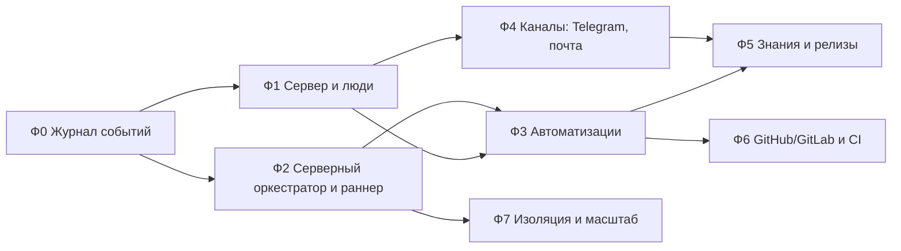

# Дорожная карта genie-платформы

Видение и архитектура — [[platform/vision]], модель автоматизаций — [[platform/automations]].

Принцип нарезки: **каждая фаза полезна сама по себе** и не ломает текущий режим «владелец + pi + локальный трекер». Локальный режим остаётся первоклассным всё время — сервер его расширяет, а не заменяет.

## Обзор

**MVP для команды** = Ф0–Ф4 + плейбуки «Разбор новой задачи» и «Знания и чейнджлог». С этого момента genie можно отдавать коллегам.

## Ф0. Журнал событий

Результат: любое изменение в трекере — долговечное событие, на которое может подписаться другой процесс.

- Таблица `events` в трекере (SCHEMA 3 → 4), запись в той же транзакции, что и изменение, для всех операций `Tracker` и `TeamBus` (не только `status`).
- Курсоры подписчиков, чтение «от курсора», очистка старых событий по сроку хранения.
- Перевод веб-SSE с опроса `PRAGMA data_version` на события с `Last-Event-ID`; клиент инвалидирует только затронутые запросы.
- `genie events tail [--type …] [--json]` в CLI — для отладки и внешних скриптов.
- Исходящие webhooks проекта (простая подписка URL + секрет + фильтр типов) — первый внешний потребитель.

Готово, когда: e2e-тест — внешний процесс получает каждое событие ровно один раз при падениях и рестартах; веб обновляет карточку по событию без опроса.

## Ф1. Сервер и люди

Результат: `genie serve` на сервере, проектом пользуются несколько человек под своими именами.

- `genie serve`: реестр проектов, клоны на сервере, фоновые задачи (сейчас разбросаны по `genie web` и надзору оркестратора), health-check, Docker-образ, systemd-юнит, бэкапы (Litestream).
- Пользователи, приглашения, magic link + OIDC, сессии, API-токены для CLI; CLI/pi умеют работать с удалённым сервером.
- Роли проекта (owner/admin/member/viewer/guest) и проверка прав в API.
- `Actor` с id пользователя; назначение задач на людей, наблюдатели, упоминания, «Мои задачи», «Ждут меня», лента активности.
- Центр уведомлений в вебе и настройки уведомлений на пользователя (что, куда, тихие часы).
- `needs_owner` с конкретным адресатом.

Готово, когда: два человека с разных машин вне tailnet работают в одном проекте, видят авторство и получают уведомления о своих задачах.

## Ф2. Серверный оркестратор и раннер

Результат: агенты работают без открытого терминала владельца.

- Интерфейс `AgentRuntime` (реализация — `pi --mode rpc`), очередь заданий с приоритетами, лимиты проекта вместо отказа `team_spawn`.
- Серверный оркестратор: пробуждение по событиям и дайджесту, короткие ходы, состояние в трекере; аренда (lease) и режим «пульт» для сессии pi человека.
- Уровни автономности проекта: `manual` / `assisted` / `autonomous`.
- Разовые агентные задания (`agent_job`) со структурированным выходом.
- Учёт токенов и стоимости на задание/задачу/проект, бюджеты, экран расходов.
- Перенос надзора (heartbeat, `team_recover`, уборка закрытых команд) в сервер.

Готово, когда: задача из веба доходит до `done` при выключенном ноутбуке владельца; рестарт сервера не теряет ни команд, ни писем.

## Ф3. Автоматизации

Результат: команда сама настраивает «когда — что делать».

- Правила, триггеры (событие, cron, webhook, ручной), шаги, долговечные запуски, идемпотентность, защита от каскадов, бюджеты — по [[platform/automations]].
- UI: список правил, конструктор (триггер → фильтр → шаги), `dry-run` на прошлых событиях, экран «Запуски» с графом шагов.
- Библиотека плейбуков с параметрами; экспорт/импорт YAML.

Готово, когда: плейбуки «Разбор новой задачи» (без шага `ask`, он в Ф4) и «Эскалация решения» включаются из UI и отрабатывают на реальных задачах.

## Ф4. Каналы

Результат: люди получают уведомления и отвечают агентам там, где им удобно.

- Абстракция канала; Telegram-бот (привязка аккаунта, личка и чат проекта, кнопки, ответы → события); почта (SMTP, входящие через IMAP или inbound-webhook, треды по токену); web push.
- Опросники: шаг `ask`, ответы в задачу, напоминания, таймауты.
- Шаблоны сообщений, дедупликация, дайджесты.

Готово, когда: пример 2 из [[platform/automations]] проходит целиком — продакт создаёт задачу в вебе, отвечает на вопросы в Telegram, задача доходит до `ready` без участия владельца.

## Ф5. Знания и релизы

Результат: закрытая задача оставляет след в документации и чейнджлоге без ручной работы.

- Пространства `docs/` с владельцами и политикой публикации (PR на ревью / сразу в main).
- Агентное задание «задача → знание»; шаг `docs.propose`; ревью изменений docs в вебе.
- Чейнджлог: записи в трекере по задачам, материализация в `Unreleased`, действие «Релиз» (версия, тег, заметки о выпуске в каналы).
- Плейбуки «Знания и чейнджлог», «Устаревшая документация», «Эпик закрыт».
- Единый поиск ⌘K по задачам, комментариям, артефактам и docs; права на чтение пространств для guest.

Готово, когда: пример 1 из [[platform/automations]] проходит целиком, и `CHANGELOG.md` следующего релиза genie собран этим механизмом.

## Ф6. GitHub/GitLab и CI

- GitHub App / GitLab-токен на проект; PR из ветки команды на `review`, merge по `mergeStrategy` на `done`.
- События `git.pr_opened`, `git.pr_merged`, `git.review_submitted`, `ci.failed`, `ci.passed` в журнал; плейбуки «CI упал», «PR смёрджен».
- Ревью человека в PR ↔ комментарии `review` в задаче.

## Ф7. Изоляция и масштаб

- Контейнер на команду/задание (worktree смонтирован, сеть и секреты по политике), удалённые раннеры, забирающие задания из очереди.
- Опционально Postgres для серверной БД; кросс-проектные отчёты.
- Аудит-лог действий людей и агентов, экспорт данных проекта.

## Что делать первым

Ф0 не зависит ни от одного открытого вопроса ниже и нужна всем следующим фазам — с неё и стоит начать, параллельно подтверждая решения P1–P8 из [[platform/vision]]. Предлагаемая нарезка Ф0 на задачи трекера:

1. Таблица `events` и запись событий из `Tracker` (все мутации) — SCHEMA 4, миграция, тесты.
2. События `TeamBus` (команды, участники, почта) в тот же журнал.
3. Курсоры подписчиков и API чтения «от курсора» + `genie events tail`.
4. Веб-SSE на событиях, точечная инвалидация запросов в SPA.
5. Исходящие webhooks проекта.

## Открытые вопросы к владельцу

1. **Хостинг**: одна инсталляция на команду (рекомендация) или сразу мультиарендный сервис для нескольких команд?
2. **Где живёт сервер**: VPS/домашний сервер с публичным доменом или только tailnet + Telegram как «внешний вход»?
3. **Знания**: `docs/` в том же репозитории, что и код (как сейчас), или отдельный репозиторий знаний на проект/пространство?
4. **Публикация docs агентами**: всегда через PR с ревью человека или по политике пространства (часть — сразу в main)?
5. **Каналы первой очереди**: Telegram + почта достаточно, или нужны Slack/Mattermost/другие?
6. **Проекты без кода** (чистый продукт/аналитика без репозитория): поддерживать с первой версии?
7. **Бюджеты**: какие лимиты расходов на модели приемлемы по умолчанию на проект в месяц?
8. **Совместимость**: сохранять ли полностью локальный режим (владелец + pi без сервера) как равноправный — рекомендация «да».
