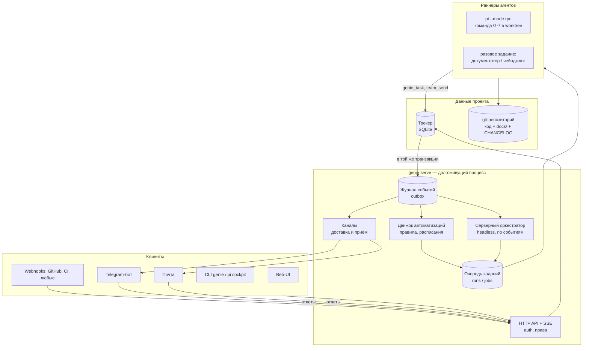

# Genie как платформа — видение и целевая архитектура

Сопутствующие страницы: [[platform/automations|модель автоматизаций]], [[platform/roadmap|дорожная карта]].

## Цель

Genie — рабочее пространство небольшой команды (2–15 человек), где **люди и агенты работают над одними задачами**:

- задачи, эпики, доска, прогресс и история — вместо Jira;
- живая документация проекта, решения, глоссарий, чейнджлог — вместо Confluence;
- агенты запускаются **сами**, по событиям, расписанию и входящим сообщениям, а не только когда владелец сидит в своей сессии pi;
- над проектом работают несколько людей с разными ролями, каждый видит своё и получает уведомления туда, где ему удобно (веб, Telegram, почта).

Критерий успеха: команда из 3–5 человек ведёт реальный продукт в genie месяц, ни разу не открыв Jira/Confluence, а доля работы, начатой автоматизацией (а не руками), заметна.

## Где мы сейчас

Что уже есть и остаётся фундаментом:

| Есть | Почему это ценно для платформы |
|---|---|
| Трекер со стейт-машиной, ролевыми правами, DoR/DoD, эпиками, артефактами, историей | Процесс зашит в код — автоматизации могут на него опираться, а не на договорённости в промптах |
| Фокус-команды с ролями, моделями на роль, worktree на команду, прямой почтой, heartbeat и восстановлением | Готовый «исполнитель» для любых агентных задач, запущенных триггером |
| Веб-интерфейс (доска, эпики, карточка, чат команды, входящие, ⌘K, docs) | Основа командного UI; архитектура FSD позволяет расти |
| Docs-система: Markdown в git, FTS5, wiki-ссылки, бэклинки, `paths` + `verified` → «возможно устарела», impact-предупреждения | Готовое ядро базы знаний; документы живут рядом с кодом и ревьюятся как код |
| Дайджест почты для оркестратора, уровни и намерения писем | Модель «агент будится сводкой, а не потоком» — то, что нужно серверному оркестратору |

Что мешает стать сервисом:

| Ограничение | Где | Следствие |
|---|---|---|
| Оркестратор — интерактивная сессия pi владельца | `src/extension/index.ts` | Без открытого терминала ничего не движется; headless-команды умирают вместе с сессией |
| События трекера — только in-process listeners и только `status` | `Tracker.onEvent` в `src/tracker/store.ts` | Другой процесс (сервер, раннер) не может надёжно реагировать на изменения; SSE в вебе работает опросом `PRAGMA data_version` |
| Один человек: роль `human`, автор из `tailscale whois` | `src/tracker/model.ts`, `src/web/server.ts` | Нет пользователей, прав, назначения на людей, подписок, персональных уведомлений |
| Нет аутентификации, слушает 127.0.0.1/tailnet | `src/web/server.ts` | Нельзя дать доступ коллеге или менеджеру вне tailnet |
| Уведомления — `notify-send` и herdr | `src/notify.ts` | Только локальный рабочий стол владельца |
| Один трекер на репозиторий в `.genie/` рабочей машины | `src/tracker/fsutil.ts` | Нет понятия «пространство → проекты», проект привязан к ноутбуку |
| Слияние веток команд вручную, нет интеграции с GitHub/GitLab | `src/team/spawn.ts` | Цикл «задача → PR → merge → done» не автоматизируем |

## Целевая картина



Ключевой сдвиг: **всё, что происходит в проекте, становится событием в долговечном журнале**, а всё, что делает система сама (оркестратор, автоматизации, уведомления), — **подписчиком этого журнала**. Человек в терминале перестаёт быть обязательным звеном.

### 1. Журнал событий (outbox)

Каждая запись в трекере (создание, смена статуса, поля, комментарий, артефакт, критерий, команда, письмо) в **той же транзакции** добавляет строку в таблицу `events`:

```
events(id INTEGER PK, at, project, type, subject, actor, actor_kind, payload JSON)
```

- Типы: `task.created`, `task.updated`, `task.status_changed`, `task.commented`, `task.artifact_added`, `task.criterion_checked`, `task.assigned`, `task.needs_owner`, `epic.progress`, `team.spawned`, `team.member_lost`, `team.stopped`, `mail.sent`, `doc.changed`, `doc.stale`, `git.pr_merged`, `ci.failed`, `channel.message_received`, `schedule.tick`, `webhook.received`, `automation.run_finished`.
- Подписчики (веб-SSE, движок автоматизаций, оркестратор, каналы) хранят свой **курсор** (`last_event_id`) и читают «от курсора» — событие не теряется при падении и обрабатывается ровно один раз на подписчика (идемпотентность по `(subscriber, event_id)`).
- SSE в вебе переходит с опроса `data_version` на поток событий с `Last-Event-ID` — клиент получает не «что-то изменилось», а что именно.
- `history` задачи остаётся как проекция для карточки; журнал — общая шина.

Это первый и самый дешёвый шаг: он не требует решений про хостинг и пользователей, но без него триггеры невозможны.

### 2. Сервер `genie serve`

Один долгоживущий процесс (Docker-образ или systemd-сервис) на VPS, домашнем сервере или в tailnet:

- держит реестр **проектов**: проект = git-репозиторий (клон на сервере) + трекер + docs; путь и ремоут настраиваются;
- поднимает API/SSE/веб (текущий `src/web/server.ts` становится частью сервера);
- крутит подписчиков журнала: движок автоматизаций, серверный оркестратор, диспетчер каналов, уборку закрытых команд (сейчас это `reapClosedTeams` раз в 20 с);
- запускает раннеры агентов и следит за ними (heartbeat и `team_recover` уже есть — переезжают в сервер);
- хранит секреты: ключи провайдеров моделей, токены ботов, SMTP, GitHub App.

CLI и расширение pi продолжают работать: локально — напрямую с SQLite, как сейчас; с удалённым сервером — через API с персональным токеном.

### 3. Люди, роли, права

Новые сущности в серверной БД: `users`, `memberships(project, user, role)`, `invites`, `sessions`, `api_tokens`, `notification_prefs`, `channel_links` (Telegram chat id, email пользователя).

| Роль в проекте | Может |
|---|---|
| owner | всё, включая автоматизации, секреты, бюджеты, участников |
| admin | всё, кроме удаления проекта и секретов |
| member | задачи, комментарии, доска, docs, запуск команд в рамках бюджета |
| viewer / guest | чтение (guest — только расшаренные эпики/документы), комментарии по желанию |

- В трекере `Actor` получает `id` пользователя вместо общего `human`; роль `human` остаётся как «класс» для правил стейт-машины (человек может всё, что сейчас может владелец), а права проекта проверяются слоем выше.
- Задачу можно назначить **человеку** (ревью, решение, ручной шаг), а не только команде; появляются наблюдатели (`watchers`), упоминания `@имя`, лента активности, «Мои задачи», «Ждут меня».
- `needs_owner` превращается в «Нужно решение от …» с конкретным адресатом (по умолчанию — автор задачи или владелец эпика).
- Аутентификация: ссылка на почту (magic link) + OIDC (Google/GitHub); passkeys позже. Агенты — отдельные принципалы с токенами проекта, у них нет прав владельца.

### 4. Серверный оркестратор

Оркестратор перестаёт быть «длинным чатом в терминале» и становится **агентом, которого будят события**:

- подписан на журнал: новые задачи во входящих, письма команд (через уже существующий дайджест), ответы людей, `needs_owner` снятые, `member_lost`;
- каждое пробуждение — короткий ход `pi --mode rpc` с дайджестом и снимком состояния из трекера; память — в трекере, а не в контексте (сессию можно компактить или начинать заново без потерь);
- **аренда (lease)**: в проекте активен один оркестратор. Интерактивная сессия pi человека может «взять пульт» (cockpit) — тогда серверный оркестратор ставится на паузу и возвращается, когда сессия отпустила аренду или замолчала;
- уровни автономности на проект: `manual` (только предлагает), `assisted` (берёт в работу, закрывает с подтверждением), `autonomous` (как сейчас, решения A2/A3).

### 5. Движок автоматизаций

Правила «**когда** событие + фильтр → **если** условие → **сделать** шаги» с долговечными запусками, идемпотентностью, бюджетами и журналом. Подробно — [[platform/automations]]. Шаги бывают трёх видов:

- детерминированные (сменить статус, создать задачу, добавить в чейнджлог, отправить уведомление, вызвать webhook);
- **агентные задания** — разовый запуск роли с целью и входами (документатор собирает артефакты задачи в страницу docs, аналитик разбирает задачу и формирует вопросы);
- **ожидание** — ждать ответа человека в канале, таймаута или события.

Оркестратор и автоматизации — не конкуренты: автоматизации отвечают за предсказуемые конвейеры («задача готова → документация + чейнджлог + уведомление»), оркестратор — за суждения («что делать с этой задачей»). Автоматизация может разбудить оркестратора, оркестратор может запустить автоматизацию.

### 6. Каналы

Единый интерфейс `Channel { send(message), receive → event }` с двусторонней связью:

- **Telegram-бот** — личные сообщения и групповой чат проекта; кнопки (одобрить, отклонить, открыть в вебе); ответ на сообщение бота привязывается к задаче/вопросу и приходит событием `channel.message_received`.
- **Почта** — исходящая через SMTP, входящая через IMAP или inbound-webhook (Mailgun/Postmark/Cloudflare Email); `Reply-To` с токеном треда.
- **Webhooks** — исходящие (Slack/Mattermost/любой сервис) и входящие (GitHub, CI, формы).
- **Веб** — центр уведомлений и web push.

Отдельная сущность **опросник** (`questionnaire`): набор вопросов от агента с адресатом, каналом, сроком и статусом ответа по каждому вопросу. Ответы сохраняются в задаче (комментарии `owner`/`decision`) и будят того, кто спрашивал. Так «аналитики собрали вопросы → менеджер ответил в Telegram → аналитики продолжили» становится штатным циклом, а не ручной пересылкой.

Входящий текст из каналов — **недоверенные данные**: он попадает к агентам как цитата с пометкой источника, не как инструкция; действия, которые меняют права, секреты или удаляют данные, из каналов недоступны.

### 7. База знаний и релизы

Docs уже живут в git и индексируются. Платформа добавляет процессы вокруг них:

- **пространства** — разделы `docs/` с владельцами (продукт, архитектура, процессы, runbooks);
- **поток «задача → знание»**: при `done` документатор сводит артефакты задачи (анализ, решения, ревью) в изменения устойчивых страниц, а не в новый файл на задачу; изменения идут веткой/PR с ревью человеком или сразу в main — по политике пространства;
- **жизненный цикл страницы**: `draft → current → deprecated`, `verified` обновляется при ревью, задачи на актуализацию «возможно устаревших» страниц создаются по расписанию;
- **чейнджлог**: раздел `Unreleased` в `CHANGELOG.md` пополняется формулировками агента по каждой закрытой задаче (с меткой `Добавлено/Изменено/Исправлено` и ссылкой на задачу); релиз — действие, которое переносит `Unreleased` в версию, ставит тег и рассылает заметки о выпуске;
- **единый поиск** по задачам, комментариям, артефактам и docs в ⌘K.

### 8. Git-хостинг и CI

GitHub App / GitLab-интеграция: ветка команды → PR при `review`, merge при `done` по `mergeStrategy`, события `pr_merged`, `ci.failed`, `review_submitted` в журнал. `ci.failed` на ветке команды будит исполнителя; ревью человека в PR превращается в комментарий `review` в задаче.

### 9. Исполнение, изоляция, стоимость

- Абстракция `AgentRuntime`: сейчас `pi --mode rpc` процессом на сервере; позже — контейнер на команду (worktree смонтирован, сеть и секреты по политике) и удалённые раннеры, забирающие задания из очереди.
- Учёт токенов и денег на запуск/задачу/эпик/проект; бюджеты на проект и на автоматизацию с жёсткой остановкой; дашборд расходов.
- Лимиты `maxActiveTeams`/`maxMembersPerTeam` становятся лимитами проекта и раннера; очередь с приоритетами вместо отказа.

## Ключевые архитектурные решения

Рекомендации — по умолчанию; каждое стоит подтвердить (см. «Открытые вопросы» в [[platform/roadmap]]).

| # | Решение | Рекомендация | Почему |
|---|---|---|---|
| P1 | Модель поставки | **Self-hosted, одна инсталляция на команду** (Docker/systemd); мультиарендный SaaS — не сейчас | Небольшие команды, код и ключи моделей остаются у команды, нет затрат на биллинг и изоляцию арендаторов |
| P2 | Хранилище | **SQLite остаётся**: серверная БД (пользователи, проекты, автоматизации, каналы, события сервера) + трекер на проект как сейчас; бэкапы Litestream. Доступ к данным — через репозитории, чтобы Postgres был возможен позже | Нулевые зависимости, проверенный WAL + `BEGIN IMMEDIATE`, трекер проекта остаётся переносимым, CLI/pi работают без изменений |
| P3 | Рантайм агентов | **pi остаётся**, за интерфейсом `AgentRuntime` | Роли, модели, MCP-фильтры, восстановление сессий уже на нём; интерфейс оставляет место для других харнессов |
| P4 | Оркестратор | **Серверный, событийный, с арендой**; сессия pi — необязательный «пульт» | Сервис должен работать без открытого терминала |
| P5 | Хранение автоматизаций | **БД + UI-редактор с версиями**, экспорт/импорт YAML; «автоматизации как код» в репозитории — опция позже | Менеджеру проще в UI; YAML нужен для шаблонов и переноса между проектами |
| P6 | Источник правды для знаний | **git (`docs/`, `CHANGELOG.md`)**, веб-редактор коммитит от имени пользователя | Уже так устроено; знания ревьюятся и версионируются вместе с кодом |
| P7 | Аутентификация | Magic link + OIDC, токены для CLI/агентов | Минимум паролей, быстро для малой команды |
| P8 | Реальное время | SSE из журнала событий с курсором | Уже используется SSE; курсор даёт догонку после разрыва |

## Что сознательно не делаем

- Не копируем Jira целиком: без настраиваемых workflow-схем, экранов и полей на каждый чих. Статусы и роли — зашитый процесс genie; гибкость — в автоматизациях.
- Не делаем свой вики-движок с WYSIWYG-блоками: Markdown в git + хороший редактор с превью.
- Не делаем тайм-трекинг, спринты с story points и отчёты «для менеджмента» в первой версии; прогресс считается по статусам и эпикам.
- Не держим отдельную «копию» задач в Telegram: канал — это уведомления и ответы, правда живёт в трекере.

## Риски

| Риск | Мера |
|---|---|
| Неуправляемые расходы на модели от автоматизаций | Бюджеты на проект и правило, лимит параллельных запусков, dry-run, стоп-кран в UI, алерт при 80% бюджета |
| Каскады правил (правило A вызывает событие для правила B …) | Глубина цепочки в payload события, лимит (по умолчанию 3), запрет самотриггера, журнал запусков с причинной цепочкой |
| Prompt injection из входящих каналов и webhooks | Входящий текст — недоверенные данные с пометкой источника; агентам из каналов недоступны опасные действия; подтверждение человеком для рискованных шагов |
| Спам уведомлениями | Настройки на пользователя, дайджесты, тихие часы, дедупликация по задаче |
| Конфликты в `docs/` и `CHANGELOG.md` при параллельных агентах | Изменения документации — через ветку и merge-очередь; чейнджлог собирается из записей в трекере и материализуется в файл одним писателем |
| Потеря данных на единственном сервере | Litestream / регулярные снапшоты SQLite, git-ремоут для кода и docs |
| Разрастание скоупа | Фазы с явным «готово» (см. [[platform/roadmap]]); каждая фаза полезна сама по себе |
